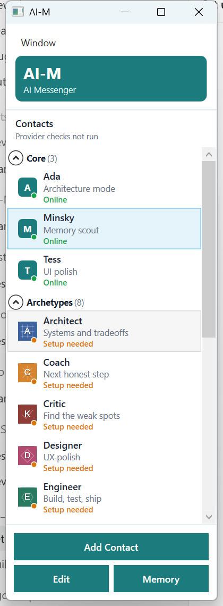
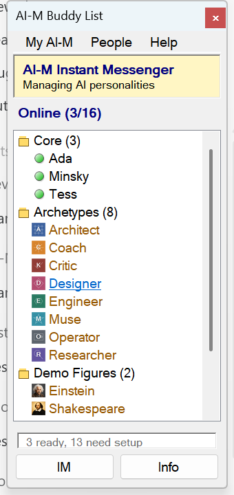
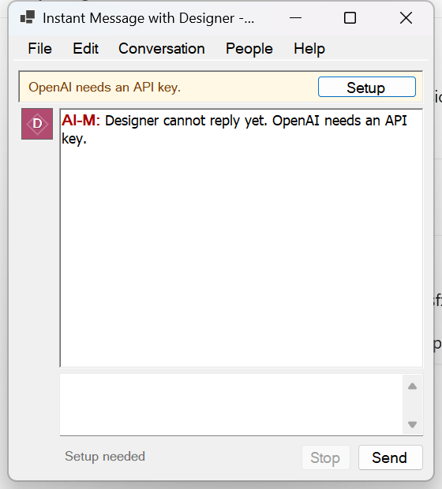

# AI-M

AI-M is an instant-messenger style desktop application for managing AI personalities. Think classic AIM or Pidgin, but each buddy is an AI persona with its own provider, memories, conversations, and approval flow.

The project is currently a Windows/.NET desktop prototype with a reusable C# core, SQLite persistence, provider integrations, a primary WPF shell, and a classic AIM-inspired WinForms shell.

## Screenshots

<table>
  <tr>
    <td><strong>WPF buddy list</strong></td>
    <td><strong>WinForms buddy list</strong></td>
    <td><strong>WinForms chat</strong></td>
  </tr>
  <tr>
    <td></td>
    <td></td>
    <td></td>
  </tr>
</table>

## What Works Today

- AIM/Pidgin-style buddy list for AI personalities.
- Floating chat windows and optional all-in-one WPF mode.
- WPF and WinForms desktop shells on the same core/storage/provider stack.
- Provider support for OpenAI, Ollama, AWS Bedrock, and a fake/demo provider.
- Provider readiness checks and first-run setup.
- Per-personality memory sets and conversation history.
- Conversation groups and summaries.
- Agent tools for memory, personality, conversation, and time operations.
- Approval-required durable changes for memory writes/deletes, personality updates, system prompt notes, and conversation summaries.
- Persistent pending action queue shared by both desktop shells.
- Prebuilt demo figures and fictional archetypes with avatar assets.

## Project Layout

- `src/AIM.Core`: provider-neutral chat, personalities, memories, conversations, tool contracts, pending actions, and self-management parsing.
- `src/AIM.Providers`: OpenAI, Ollama, AWS Bedrock, fake provider, diagnostics, and provider status services.
- `src/AIM.Storage`: EF Core/SQLite persistence and migrations.
- `src/AIM.Desktop.Wpf`: primary WPF shell with floating chats, provider setup, memory review, personality editor, pending actions, and tray behavior.
- `src/AIM.Desktop.WinForms`: classic AIM-inspired WinForms shell.
- `tests/AIM.Tests`: xUnit coverage for storage, providers, tools, context building, parsing, pending approvals, and migrations.
- `docs`: architecture, development, roadmap, and feature notes.

## Requirements

- Windows
- .NET 10 SDK
- Optional provider dependencies:
  - OpenAI API key
  - Ollama running locally or reachable over HTTP
  - AWS credentials/region for Bedrock

## Quick Start

```powershell
dotnet restore AIM.slnx
dotnet build AIM.slnx
dotnet test tests\AIM.Tests\AIM.Tests.csproj
```

Run the primary WPF shell:

```powershell
dotnet run --project src\AIM.Desktop.Wpf\AIM.Desktop.Wpf.csproj
```

Run the classic WinForms shell:

```powershell
dotnet run --project src\AIM.Desktop.WinForms\AIM.Desktop.WinForms.csproj
```

Publish local Windows builds:

```powershell
.\scripts\publish-desktop.ps1
```

For demo screenshots or local exploration without the first-run setup dialog:

```powershell
$env:AIM_DEMO_MODE="true"
dotnet run --project src\AIM.Desktop.Wpf\AIM.Desktop.Wpf.csproj
```

## Provider Configuration

The desktop apps include provider setup screens. OpenAI can also be configured with environment variables:

```powershell
$env:OPENAI_API_KEY="..."
$env:AIM_OPENAI_MODEL="gpt-4.1-mini"
```

Saved provider accounts live in the local SQLite database. Credentials are protected with Windows data protection where available.

## Local Data And Privacy

AI-M stores runtime data locally under `%LocalAppData%\AI-M` by default.

- SQLite database: `%LocalAppData%\AI-M\aim.db`
- Pending approvals: `%LocalAppData%\AI-M\pending-actions.json`
- First-run preference: `%LocalAppData%\AI-M\setup-preferences.json`

You can point storage at a throwaway database for testing or screenshots:

```powershell
$env:AIM_SQLITE_PATH="$pwd\artifacts\demo\aim.db"
```

Build outputs, local databases, app settings, Visual Studio state, provider credentials, and `.env` files are ignored by git.

## Documentation

- [Architecture](docs/ARCHITECTURE.md)
- [Development](docs/DEVELOPMENT.md)
- [Pending Actions](docs/PENDING_ACTIONS.md)
- [Releasing](docs/RELEASING.md)
- [Roadmap](docs/ROADMAP.md)

## Project Status

AI-M is early and actively evolving. The core architecture, storage, provider plumbing, memory flow, tool approvals, and two desktop shells are in place, but UX polish, provider breadth, packaging, and long-running agent workflows are still moving targets.

## License

AI-M is licensed under the [MIT License](LICENSE).
